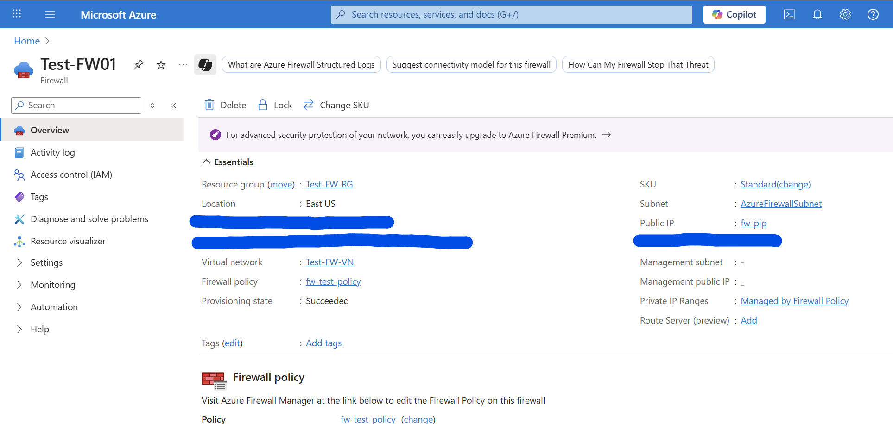

# Azure Firewall ARM Template

This ARM template deploys an Azure Firewall with custom DNAT, network, and application rules.

## Overview

This project showcases hands-on experience with deploying and configuring a Microsoft Azure Firewall using Infrastructure as Code (IaC) through an ARM (Azure Resource Manager) template. It was completed as part of a student learning experience to gain practical understanding of cloud network security, resource automation, and Azure infrastructure services.

## Project Objective

The goal of this project was to:
Create a secure, scalable virtual network.
Deploy a standard-tier Azure Firewall across availability zones.
Apply a custom Firewall Policy with constraints and alerts.
Use ARM templates for reproducibility and automation.

## How to deploy

Use the Azure CLI command:

bash:
az deployment group create \
  --name DeployFirewall \
  --resource-group Test-FW-RG \
  --template-file azurefirewall.json

## Overview
This project demonstrates how to manage Azure Firewall as infrastructure-as-code. The template allows you to redeploy the same firewall setup consistently across environments using version-controlled infrastructure.

## Architecture
Firewall Name: Test-FW01

Region: East US

SKU: AZFW_VNet (Standard Tier)

Availability Zones: 1, 2, 3

Threat Intelligence: Alert Mode

Private IP Address: 10.0.1.4

Public IP: Associated (fw-pip)

Virtual Network: Test-FW-VN

Subnet: AzureFirewallSubnet

Firewall Policy: fw-test-policy
